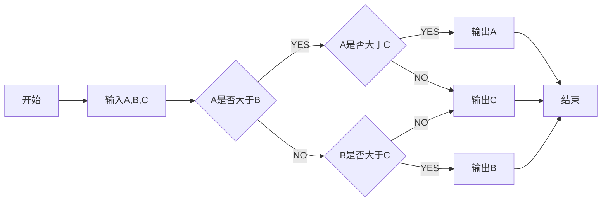
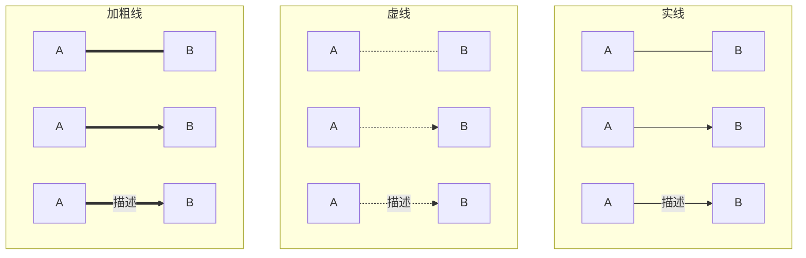

markdown中添加流程图
===

## Mermaid是什么？

Mermaid 是一个用于画流程图、状态图、时序图、甘特图的库，使用 JS 进行本地渲染，广泛集成于许多 Markdown 编辑器中。

## 怎么使用 Mermaid？

### 基本格式

```mermaid
graph 流程图方向[TB|LR|RL|BT]
 	    流程图内容
```

### 例子



### 详细说明

#### 第一行出现的
```
graph [TB|BT|LR|RL|TD]
```

* 纵向：TB：从上至下；BT：从下至上；TD：从上至下
* 横向：LR：从左至右；RL：从右至左


#### 定义框体

##### 结构:

```
	id【包围符】【显示文本】【包围符】
```

##### 示例


#### 定义连接线和子图

##### 连接线结构

```
id1【连接【文本】符】id2
```

##### 子图结构

```
subgraph 子图名
	子图内容
	end
```

##### 连接线格式例子（用子图分组）


