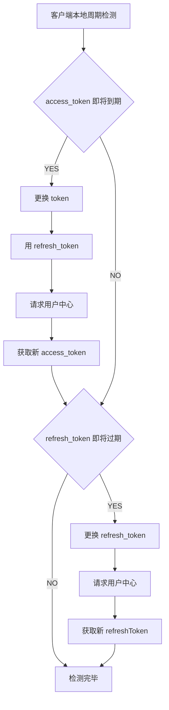

### JWT Access & Refresh Token authentication with spring and mongodb

```mermaid
graph TB
          start[客户端本地周期检测] --> conditionA{access_token 即将到期}
          conditionA -- YES --> printA[更换 token] --> printB[用 refresh_token] --> printC[请求用户中心] --> printD[获取新 access_token] --> conditionB
          conditionA -- NO --> conditionB{refresh_token 即将过期}
          conditionB -- YES --> printE[更换 refresh_token] --> printF[请求用户中心] --> printG[获取新 refreshToken]
          conditionB -- NO --> stop[检测完毕]
          printG --> stop[检测完毕]
```

这种方案种有两种 token: 
* 一种是 refresh_token, 用于更换 access_token, 有效期为 30 天;
* 另一种是 access_token, 用于保存当前用户信息和权限信息, 每隔 5 分钟更换一次;
